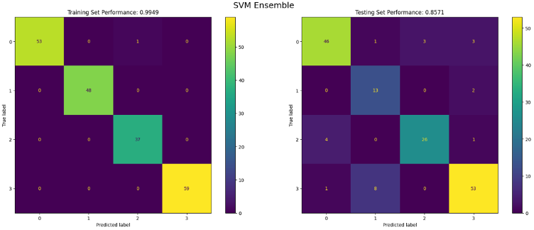
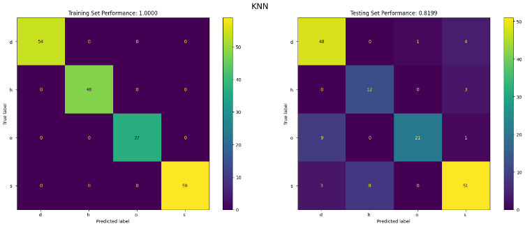
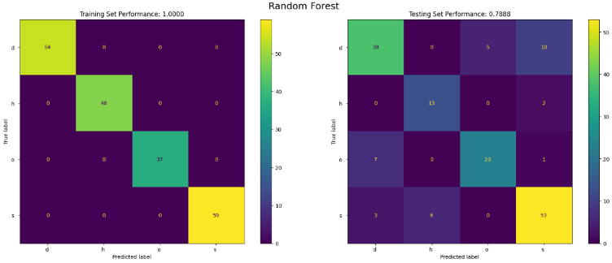

# Land Classification using Machine Learning

## Overview
This project applies machine learning models to classify land types using spectral data.

## Models Used
- K-Nearest Neighbours (KNN)
- Random Forest
- Support Vector Machine (SVM Ensemble)

## Key Work
- Data preprocessing and scaling
- Hyperparameter tuning using validation set
- Model evaluation using test data
- Confusion matrix and classification analysis

## Results
The SVM ensemble achieved the best generalisation performance compared to KNN and Random Forest.

## Visuals

### Confusion Matrix (SVM)

### Models

## Tech Stack
- Python
- scikit-learn
- Jupyter Notebook
